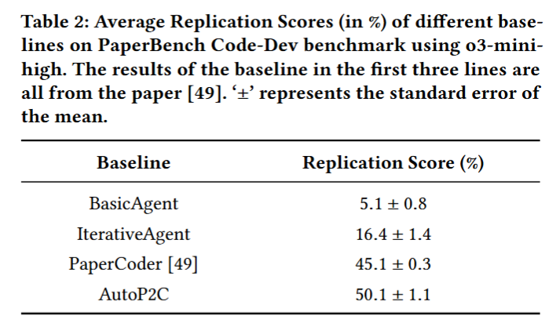

# AutoP2C: An LLM-Based Agent Framework for Code Repository Generation from Multimodal Content in Academic Papers
If You Find This Paper or Code Helpful, Please Star Our Project ⭐

We've put a lot of effort into maintaining this repository 🚀, and we hope it proves useful to you 🙏.

If you have any questions, please feel free to ask me in the issue. I will do my best to answer them if I am available :nerd_face: .

## Chapter
1. [Overview](#Overview)

2. [Results](#Results)

3. [Quick Start](#Quick-Start)

## Overview
This repository is created for the paper “[AutoP2C: An LLM-Based Agent Framework for Code Repository Generation from Multimodal Content in Academic Papers](https://arxiv.org/pdf/2504.20115).”, we focus on how to automatically generate a code repository for an academic paper with multimodal content and call it the ``Paper-to-Code'' (P2C) task, as shown in Figure 1.

Specifically, given a research paper containing heterogeneous, multimodal content, P2C aims to generate a complete executable code repository that accurately implements the described methods and reproduces the reported results.

To fill this research-to-implementation gap, we propose AutoP2C, a multi-agent framework specifically designed to generate complete code repositories from the multimodal content of research papers, as shown in Figure 2.

AutoP2C comprises four stages. In the first stage, it extracts universal code structures from established repositories to construct architectural blueprints. The next stage involves multimodal content parsing, which integrates information from text, diagrams, and tables into a unified representation. In the third stage, divide-and-conquer task planning decomposes complex implementations into hierarchical subtasks with clearly defined interfaces. 
Finally, execution feedback-driven debugging localizes errors and aligns the code with the multimodal specifications of the paper through iterative testing. Unlike previous approaches that treat code generation as a unimodal text-to-text translation problem, AutoP2C takes advantage of multimodal understanding to capture the full spectrum of information presented in academic papers. 

## Results
To provide a comprehensive evaluation, we consider two complementary benchmarks, Paper2Repo, and PaperBench Code-Dev, each emphasizing a different aspect of repository quality. 
(1) To evaluate how faithfully AutoP2C implements diverse models and algorithmic designs described in each paper, we constructed a brand-new benchmark called **Paper2Repo**, which comprises eight recent research papers all published after 2024. Each paper contains all the content required for the reproduction of the code repository. These papers are selected from “[paperwithcode.com](paperswithcode.com)”, and each has a corresponding GitHub repository as the upper bound for comparison. The benchmark spans six ML tasks (including training strategy optimization, node classification, model compression, parameter-efficient fine-tuning, network pruning, and image classification) and three modal types of datasets (containing computer vision, natural language processing, and graph-related datasets). We also established baselines using two state-of-the-art LLMs: OpenAI's recently released o1 and DeepSeek-R1, both known for their advanced code generation capabilities. The results are shown as follows: 

(2) To further assess the completeness of the code repositories generated by AutoP2C, we evaluated our framework on OpenAI’s newly released **PaperBench Code-Dev** benchmark. We compared AutoP2C with several established baselines introduced in PaperBench, as well as PaperCoder, a recent multi-agent framework expressly designed to create code repositories from research papers. The results are shown as follows:

## Quick Start
We have now released an initial version of the code. You can have a try by following the steps.  

You can first translate the paper using [MinerU](https://github.com/opendatalab/MinerU) and put the transformed paper content under markdown_files/paper.md. Then, execute the run.sh.

If you want to generate a fully executable code repository for your paper, you can try running
\begin{verbatim}
bash run.sh
\end{verbatim}
It will reproduce, as faithfully as possible, the methods and models described in your paper. If you just want to test the performance of this code on PaperBench Code-Dev, you can execute
\begin{verbatim}
bash run_simple.sh
\end{verbatim}
This will create a folder that tests only the completeness of the repository; please refer to \url{https://github.com/openai/preparedness} for the testing methodology. You can test a single paper by running:
\begin{verbatim}
python -m paperbench.scripts.run_judge \
  --submission-path /home/lzj/code_for_run/paper2code/iter_code/semantic/code_generate \
  --paper-id semantic-self-consistency \
  --judge simple \
  --model o3-mini \
  --out-dir /home/lzj/code_for_run/paper2code/iter_code/semantic/grades \
  --code-only
\end{verbatim}

